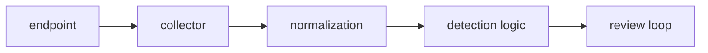

Lorem ipsum dolor sit amet, consectetur adipiscing elit. This fake homelab entry is designed to look like a real engineering note: enough structure to validate the typography, not enough truth to pretend it is already finished.

## 00 // Target architecture

A future real note could describe a small detection stack with a few explicit constraints:

1. low-cost hardware;
2. transparent log flow;
3. rules that can be tested locally;
4. dashboards that explain, not decorate;
5. rollback paths for every experiment.




Mermaid is written as markdown here, but rendering depends on whether you later add Mermaid support. For now it remains a readable code block in most Hugo setups.


## 01 // Event sketch

```json
{
  "operator": "flouksac",
  "encoded": "ZmxvdWtzYWM=",
  "source": "lab-endpoint-01",
  "event_category": "process",
  "process_name": "lorem.exe",
  "command_line": "lorem.exe --ipsum --dolor",
  "risk": "placeholder"
}
```

### Rule draft

```yaml
title: Placeholder Suspicious Lorem Process
id: 464c4b00-0000-4000-9000-placeholder
description: Detects a fake command used only to validate article formatting.
logsource:
  category: process_creation
detection:
  selection:
    CommandLine|contains:
      - "--ipsum"
      - "--dolor"
  condition: selection
level: low
```

## 02 // Operator notes

| Layer | What to document | Why it matters |
|---|---|---|
| Collection | agent, source, transport | explains blind spots |
| Parsing | fields, failures, mappings | prevents fake confidence |
| Detection | hypothesis, logic, tests | keeps rules honest |
| Review | false positives, drift | makes the lab useful |


python replay.py --dataset lorem-lab --speed 2x
python test_rules.py --rules rules/ --events artifacts/events.jsonl
jq '.event_category' artifacts/events.jsonl | sort | uniq -c


## 03 // Badges and themes

   

Lorem ipsum dolor sit amet, consectetur adipiscing elit. Replace this paragraph with the first real experiment once the detection node exists.
